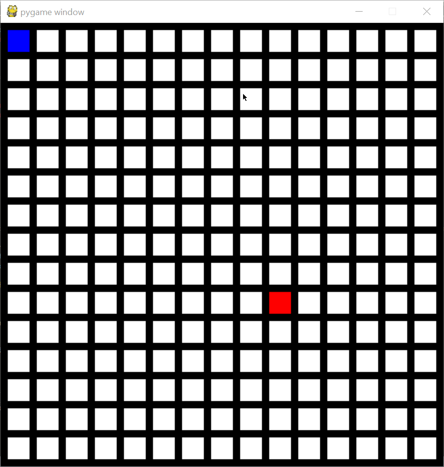

# pygamepath
visual pygame implementation of path finding algorithm

Press z while hovering over a square to change the location of the end.

Left click to draw walls

Right click to erase walls

Press c to clear the screen

Press p to solve the path

Press x on a square to move the start

